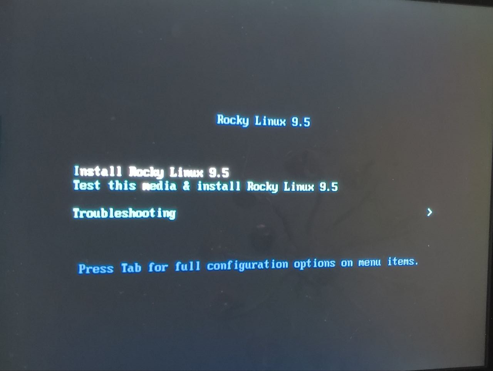

# rocky linux installation 


install [rocky linux](https://download.rockylinux.org/pub/rocky/9/isos/x86_64/Rocky-9.5-x86_64-dvd.iso) ISO and burn it to usb stick using [rufus](https://github.com/pbatard/rufus/releases/download/v4.7/rufus-4.7p.exe) if on windows or dd if on linux. <br>

1. Boot from USB with rocky linux, and select "install rocky linux" <br>



# System setup

clone repo
```bash
git clone https://github.com/Amir1330/kiosk-rocky-rocky
```


### extensions <br>
[hide top bar](https://extensions.gnome.org/extension/545/hide-top-bar/)  <br>
[disable gestures 2021](https://extensions.gnome.org/extension/4049/disable-gestures-2021/)  <br>
[No overview at start-up](https://extensions.gnome.org/extension/4099/no-overview/)  <br> 


